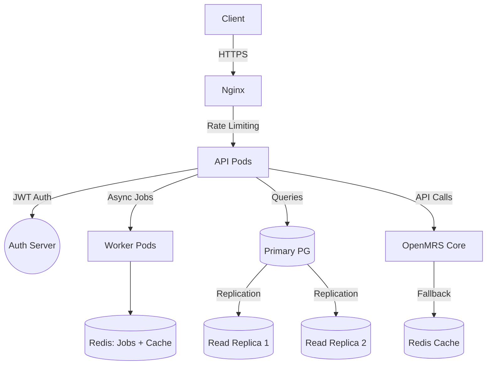

# 🚀 Comprehensive Blueprint: Ruby on Rails Middleware for OpenMRS (O3)  
*(Revised & Enhanced)*  

---

## 1. Vision & Motivation  
OpenMRS is a robust open-source EMR system, but direct modifications to its core for custom programs (e.g., HIV, maternal health, eye care) make upgrades and long-term maintenance difficult. This project introduces a Ruby on Rails middleware to sit between clients (UI) and OpenMRS, refining API behavior, enabling plugin-based expansion, and handling program-specific logic externally.  

**Key Additions**:  
- **Decoupling**: Avoid "vendor lock-in" by isolating program logic from OpenMRS Core.  
- **FHIR Compatibility**: Future-proof interoperability with healthcare systems via OpenMRS FHIR module.  

---

## 2. Architecture Overview  

### 2.1 Architecture Diagram  


### 2.2 Key Components  
| Component        | Role |  
|------------------|------|  
| **Nginx**        | Routes secure HTTP traffic + rate limiting. |  
| **Keycloak**     | OAuth2/JWT authentication/authorization. |  
| **Redis**        | Session storage, job queueing, and API caching. |  
| **API Pods**     | Host Rails middleware with refined logic. |  
| **Worker Pods**  | Handle async tasks (e.g., data syncs). |  
| **PG Cluster**   | PostgreSQL primary + read replicas for scalability. |  

---

## 3. Middleware Goals  
| Goal | Description |  
|------|-------------|  
| **API Refinement** | Add validation, filtering, and GraphQL-like querying. |  
| **Pluggable Modules** | Health programs as Rails engines (e.g., `EyeCare::Engine`). |  
| **Diagnosis Engine** | Rule-based (YAML) engine with optional ML integration. |  
| **Audit Logging** | Track API requests and data changes. |  
| **Idempotency** | Safely handle retries for POST/PUT endpoints. |  

---

## 4. MVP Scope and Starting Point  

### ✅ MVP Priorities  
1. **Patient API Wrappers**  
   - `GET /patients` with JWT validation.  
   - Standardized error responses (e.g., `{ "error": "Invalid patient ID", "code": 400 }`).  
2. **Diagnosis API**  
   - `POST /diagnoses` with YAML rule processing.  
3. **Auth Integration**  
   - JWT token validation via Keycloak.  
4. **Logging**  
   - Structured logs using `Lograge`.  

---

## 5. Project Roadmap  
| Phase | Deliverables | Timeframe |  
|-------|--------------|-----------|  
| Phase 1 | Docker, PG, Redis, Keycloak setup | Week 1 |  
| Phase 2 | Patient/encounter APIs + auth middleware | Week 2 |  
| Phase 3 | Diagnosis engine with YAML validation | Week 3 |  
| Phase 4 | EyeCare plugin + dependency management | Week 4 |  
| Phase 5 | Concept mapper with fallback terms | Week 5 |  
| Phase 6 | Read replicas + OpenMRS circuit breakers | Week 6 |  
| Phase 7 | CI/CD smoke tests + Grafana alerts | Week 7 |  
| Phase 8 | Load testing, final docs | Week 8 |  

---

## 6. Modular Plugin Architecture  
**Lifecycle Hooks**:  
```ruby  
# engines/eye_care/engine.rb  
module EyeCare  
  class Engine < ::Rails::Engine  
    config.before_initialize { load_configurations }  
  end  
end  
```  

**Dependency Management**:  
```yaml  
plugins:  
  - name: eye_care  
    depends_on: [concept_mapper]  
```  

---

## 7. Diagnosis Engine (MVP)  
**Prioritized Rules**:  
```yaml  
- condition: "fever > 39 && headache"  
  diagnosis: "Malaria Suspected"  
  priority: 1  
```  
- **Validation**: YAML syntax checks in CI/CD pipelines.  

---

## 8. Security & Scaling  
| Layer | Strategy |  
|-------|----------|  
| **Auth** | JWT tokens with `jwt` gem. |  
| **Encryption** | `Lockbox` gem for sensitive fields. |  
| **Rate Limiting** | Nginx: 100 requests/minute per IP. |  
| **Circuit Breakers** | `resilient` gem for OpenMRS failover. |  

---

## 9. Development Stack  
- **Backend**: Ruby on Rails 7  
- **Auth**: Keycloak + `jwt` gem  
- **APIs**: `Faraday` with retry logic  
- **Logging**: `Lograge` + ELK (optional)  
- **DevOps**: Docker, Kubernetes, Helm  

---

## 10. Risks and Mitigations  
| Risk | Mitigation |  
|------|------------|  
| Data Drift | Nightly checksum validation. |  
| API Versioning | `Accept-Version` header. |  
| Rule Conflicts | YAML priority flags + CI validation. |  

---

## 11. Developer Notes  
- **Code Standards**: RuboCop linting in CI.  
- **Testing**: RSpec + Pact contract testing.  
- **Error Handling**:  
  ```ruby  
  rescue_from StandardError, with: ->(e) { render_error(e.message, 500) }  
  ```  

---

## 12. Deliverables Checklist  
| Task | Owner | Status | Priority |  
|------|-------|--------|----------|  
| Rails + PG Setup | Backend | ✅ | P0 |  
| Auth Middleware | Security | 🚧 | P0 |  
| Diagnosis Engine | Logic | ⏳ | P1 |  
| Helm Charts | DevOps | ⏳ | P2 |  

---

## 13. Appendices  

### API Contracts  
- **Swagger Hub**: `https://api-specs.example.com/openmrs-middleware` *(Placeholder)*  

### Deployment Playbook  
1. Rollback: `helm rollback middleware-v1.2.0`.  
2. Disaster Recovery: Restore PG from nightly backups.  

### Sample Helm Chart  
```yaml  
# helm/templates/deployment.yaml  
apiVersion: apps/v1  
kind: Deployment  
spec:  
  replicas: 3  
  strategy:  
    rollingUpdate:  
      maxUnavailable: 1  
```  
